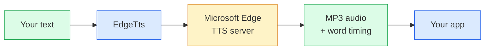

# kothok-edge-tts

[](https://crates.io/crates/kothok-edge-tts)
[](https://docs.rs/kothok-edge-tts)
[](LICENSE)

A Microsoft Edge online **text-to-speech** client for Rust. Replicates the Edge
browser "Read Aloud" WebSocket protocol. Returns the same **400+ neural voices
across 140+ locales** as streaming MP3 frames plus word-boundary metadata for
highlighting.

Part of the **KoThok e-reader ecosystem**:

| Repo | Role |
|---|---|
| **KoThok (EReader)** | E-reader app built on kobo-core |
| **kobo-core** | Kobo device SDK (framebuffer, touch, audio, EPUB) |
| **kothok-edge-tts** (this) | Edge TTS WebSocket client |

Built on `tokio`, `tokio-tungstenite`, `rustls` (ring), and `serde`. No system
TLS or audio libraries required: everything compiles from source via `cargo`.

## Architecture

Your text goes in, MP3 audio comes out:



Each `synthesize()` call does 4 things:
1. Builds a DRM token (Microsoft requires it)
2. Opens a secure WebSocket to `speech.platform.bing.com`
3. Sends your text as SSML
4. Streams back MP3 chunks + word timing until done

Internal modules (`auth`, `connection`, `protocol`, `ssml`) are crate-private.

## Install

```bash
cargo add kothok-edge-tts
```

## Quick start

```rust,ignore
use kothok_edge_tts::{init_tls, EdgeTts, Engine, TtsEvent};

#[tokio::main]
async fn main() -> Result<(), Box<dyn std::error::Error>> {
    init_tls(); // once, before the first connect

    let events = EdgeTts
        .synthesize("Hello world.", "en-US-EmmaMultilingualNeural", "+0%", "en-US")
        .await?;

    let mut audio = Vec::new();
    for ev in events {
        match ev {
            TtsEvent::Audio(bytes) => audio.extend_from_slice(&bytes),
            TtsEvent::WordBoundary { offset, text, .. } => {
                println!("word \"{text}\" at {offset} ticks");
            }
            TtsEvent::TurnEnd => {}
        }
    }
    // audio == raw MP3 (audio-24khz-48kbitrate-mono-mp3)
    Ok(())
}
```

## Multi-language

Any Microsoft neural voice works. Just pass the voice short-name and BCP-47
lang tag:

```rust,no_run
# use kothok_edge_tts::*;
# async fn run() -> Result<(), Box<dyn std::error::Error>> {
EdgeTts.synthesize("Hello", "en-US-EmmaMultilingualNeural", "+0%", "en-US").await?;
EdgeTts.synthesize("নমস্কার", "bn-BD-NabanitaNeural", "+0%", "bn-BD").await?;
EdgeTts.synthesize("مرحبا", "ar-SA-ZariyahNeural", "+0%", "ar-SA").await?;
# Ok(()) }
```

Full voice list: [Microsoft Speech language support](https://learn.microsoft.com/en-us/azure/ai-services/speech-service/language-support)

### `synthesize` parameters

| Parameter | Description | Example |
|-----------|-------------|---------|
| `text` | One utterance (max ~4 KB; chunk longer text) | `"Hello world."` |
| `voice` | Voice short-name | `"en-US-EmmaMultilingualNeural"` |
| `rate` | SSML prosody rate | `"+0%"`, `"+25%"`, `"-10%"` |
| `lang` | BCP-47 language tag | `"en-US"`, `"bn-BD"` |

## Swappable backend

`EdgeTts` implements the `Engine` trait. Implement it yourself to mock or swap
backends:

```rust,no_run
# use kothok_edge_tts::*;
# use std::future::Future;
struct MockTts;
impl Engine for MockTts {
    fn synthesize(&self, _: &str, _: &str, _: &str, _: &str)
        -> impl Future<Output = Result<Vec<TtsEvent>, TtsError>> + Send
    { async { Ok(vec![TtsEvent::Audio(vec![0xFF; 100]), TtsEvent::TurnEnd]) } }
}
```

## Token rotation

Microsoft rotates the `SEC_MS_GEC_VERSION` constant on Edge release cycles. A
[daily CI job](.github/workflows/token-check.yml) detects when it goes stale
(HTTP 403) and auto-creates a GitHub Issue with fix steps. Users should pin to
the latest published version.

## Acknowledgements

Protocol logic ported from [**edge-tts**](https://github.com/rany2/edge-tts) by
[rany2](https://github.com/rany2): the reference Python implementation. All
credit for reverse-engineering the Edge Read-Aloud protocol goes to that project.

## API reference

Complete alphabetical list of everything exported from this crate.

| Name | Kind | Description |
|------|------|-------------|
| `DEFAULT_VOICE_BN` | const | Default Bangla voice: `"bn-BD-NabanitaNeural"` |
| `DEFAULT_VOICE_EN` | const | Default English voice: `"en-US-EmmaMultilingualNeural"` |
| `EdgeTts` | struct | Reference `Engine` impl. Stateless: each call opens a fresh WebSocket |
| `Engine` | trait | Swappable TTS-backend contract: `synthesize(text, voice, rate, lang)` |
| `init_tls()` | fn | Install rustls `ring` crypto provider. Call once at startup. Idempotent |
| `list_voices()` | fn (async) | Fetch full voice catalogue from Edge server. Returns `Vec<VoiceInfo>` |
| `load_voice_cache(path)` | fn | Load cached voices from a JSON file on disk |
| `normalize_lang(lang)` | fn | Map `"bn"` to `"bn-BD"`, `"ar"` to `"ar-SA"`, etc. Falls back to `"en-US"` |
| `save_voice_cache(path, &vec)` | fn | Save voices to a JSON file on disk |
| `set_dynamic_voices(vec)` | fn | Store fetched voices for `voices_for_lang` lookups |
| `spawn_voice_fetch()` | fn | Spawn background thread that fetches voices, returns `Receiver<Vec<VoiceInfo>>` |
| `TtsError` | enum | Crate error type. Variants: `Connect`, `Ws`, `Io`, `NoAudio` |
| `TtsEvent` | enum | Stream events. Variants: `Audio(Vec<u8>)`, `WordBoundary{offset, duration, text}`, `TurnEnd` |
| `voice_label(voice_id)` | fn | Human-readable label for a voice ID: `"Nabanita (bn-BD)"` |
| `VoiceEntry` | struct | UI-facing voice with `id()` and `label()` accessors |
| `VoiceInfo` | struct | Server voice entry with `short_name()`, `locale()`, `gender()`, `friendly_name()` accessors |
| `voices_for_lang(lang)` | fn | Get `VoiceEntry` list for a language (dynamic if fetched, fallback otherwise) |

## License

MIT ([LICENSE](LICENSE)).
